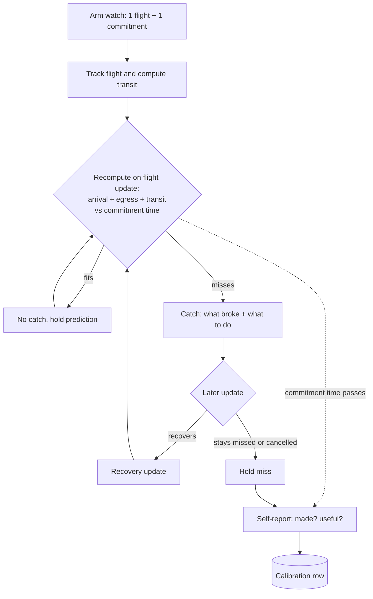

# Reconciliation Walking Skeleton: Slice 1

## Summary

The thinnest end-to-end proof of the reconciliation thesis: track one flight, attach one manually-entered timed commitment (time + place), and when a delay means the traveler can no longer make it, push a catch that says what broke and what to do — no auto-fix. Every watch logs a prediction-vs-outcome record so the calibration corpus exists from v1.

---

## Problem Frame

The product's wedge is real-time reconciliation, and its only durable moat is the calibration corpus built from logged prediction-vs-outcome data. Neither is exercised by flight tracking alone — a tracked flight with nothing downstream has nothing to collide with. This slice puts the smallest possible collision in front of the engine (one flight, one timed commitment) so the detect→advise loop runs end-to-end and the telemetry that seeds the moat starts recording on the first trip. Manual single-commitment entry deliberately caps volume; this slice proves value, not scale — slice 2 automates ingestion.

---

## Key Decisions

- No LLM in slice 1. Collision detection is deterministic interval arithmetic; advice is templated from the structured facts. The natural-language concierge (richer advice, drafting outreach, messy-input handling) is deferred. This keeps the thinnest slice reliable and isolates the moat (calibration data) from model variance — consistent with the strategy's framing that the reconciliation logic, not the LLM, is the product.
- Transit time is computed, not entered. The airport→commitment travel time comes from a single static Mapbox lookup (geocode the place, fetch duration), with manual buffer entry only as a fallback when geocoding fails. A real buffer is what makes the calibration corpus real; a typed guess would calibrate the engine against guesses.
- Outcome is captured from both flight-actuals and a self-report. The actual flight arrival grounds flight-prediction accuracy; a single post-commitment self-report ("did you make it? was the heads-up useful?") grounds the real made/missed result and the useful-catch signal. Inference from flight data alone would grade the engine against its own assumptions.
- One canonical commitment shape. A timed, place-anchored commitment carrying a time, a place, an arrival margin, and a reschedulable flag (plus an optional contact). Advice branches on the reschedulable flag. One shape is enough to prove the thesis; an archetype library is deferred.
- Deterministic collision rule. A collision is predicted when estimated arrival at the commitment (flight estimated-arrival + a fixed post-arrival egress allowance + computed transit) exceeds the commitment time minus its arrival margin. This is the interval-arithmetic-with-buffers core; the allowance, margin defaults, and anti-flap threshold are planning-tunable.

---

## Actors

- A1. Traveler — the complex-trip organizer. Arms the watch, receives catches, answers the self-report.
- A2. Flight-status source (AeroDataBox) — estimated arrival, delay, cancellation, actual arrival.
- A3. Transit source (Mapbox) — geocodes the place, supplies airport→place duration.
- A4. Reconciliation engine — recomputes the prediction on each flight update and decides when to fire.
- A5. Notification channel (push / FCM) — delivers catches and recovery updates.
- A6. Calibration log — records prediction-vs-outcome rows.

---

## Key Flows

- F1. Arm the watch. **Trigger:** traveler enters one flight (number + date) and one commitment (time, place, margin, reschedulable?). **Steps:** system begins tracking the flight, geocodes the place, computes transit, establishes a baseline make/miss prediction with current slack. No alert on arming unless already colliding. **Covers:** R1, R2, R5.
- F2. The catch. **Trigger:** a flight update worsens estimated arrival. **Steps:** the engine recomputes; predicted arrival-at-commitment crosses past (commitment time − margin); a catch fires on push stating what broke and what to do; the prediction is logged. **Covers:** R4, R7, R8, R12.
- F3. Recovery. **Trigger:** a later update restores enough slack. **Steps:** a recovery update fires; the reversal is logged. **Covers:** R9.
- F4. Cancellation / hard break. **Trigger:** the flight is cancelled or delayed past any feasible arrival. **Steps:** the catch states the commitment is lost and what to do; logged as a definite miss. **Covers:** R6.
- F5. Outcome capture. **Trigger:** the commitment time passes. **Steps:** a single self-report asks made/missed/changed and whether the heads-up was useful; the answer plus the actual flight arrival complete the row. A clean trip (predicted make, made, no catch) is recorded too. **Covers:** R11, R13, R14.

---

## Requirements

**Trip setup (ingestion)**

- R1. The traveler can arm a watch by entering one flight (flight number + date) and one timed commitment (time, place, arrival margin, reschedulable flag, optional contact).
- R2. On arming, the system tracks the flight via AeroDataBox and computes the airport→place transit via a single Mapbox lookup; if the place can't be geocoded unambiguously, it falls back to a manual buffer the traveler enters.
- R3. Slice 1 supports exactly one active flight and one commitment per watch.

**Reconciliation**

- R4. The engine predicts a collision when (flight estimated-arrival + fixed egress allowance + transit) exceeds (commitment time − arrival margin), recomputing on each flight-status update.
- R5. The engine maintains a current make/miss prediction and the slack or deficit from arming through the commitment time.
- R6. A cancellation, or a delay past any feasible arrival, is treated as a definite miss.

**Advice and notification**

- R7. When the prediction first flips to miss (beyond an anti-flap threshold), a catch fires on push stating what broke (new arrival, projected arrival at the place) and what to do.
- R8. The advice is actionable and branches on the reschedulable flag: reschedulable → contact the place and push to a computed realistic time; fixed → state the commitment is likely lost and the cancellation/exchange window.
- R9. If a fired miss later recovers, a recovery update fires.
- R10. Slice 1 never acts on the traveler's behalf (no rebooking, no contacting venues) — it only advises.

**Telemetry and calibration**

- R11. Every watch writes a prediction-vs-outcome record, clean trips included.
- R12. The record captures each fired prediction with its inputs (estimated arrival, egress allowance, transit used, margin, resulting slack/deficit) and timestamps.
- R13. The record captures the actual flight arrival from AeroDataBox actuals.
- R14. After the commitment time, a single self-report captures made/missed/changed and whether the heads-up was useful; an unanswered prompt is recorded as a missing self-report, not a failure.
- R15. The calibration record is produced in slice 1 even at tiny n — it is the moat sub-component and is not deferred.

**Instrumentation**

- R16. The slice records the STRATEGY.md metrics from v1: thesis-exercising trips created, cascade-alert usefulness rate with its denominator (cascade events observed), first-useful-catch rate, and prediction-vs-outcome accuracy (read with the event count, not as an early trend).

---

## Acceptance Examples

- AE1. Delay causes a miss. **Given** a tracked flight and a commitment with computed transit; **When** estimated arrival slips so arrival-at-commitment passes (time − margin); **Then** a catch fires with what-broke + what-to-do and a prediction row is written. **Covers:** R4, R7, R8, R12.
- AE2. Delay then recovery. **Given** a fired catch; **When** a later update restores slack; **Then** a recovery update fires and the reversal is logged. **Covers:** R9.
- AE3. Cancellation. **Given** a tracked flight; **When** it is cancelled; **Then** the catch states the commitment is lost and what to do, logged as a definite miss. **Covers:** R6.
- AE4. Geocoding fails. **Given** a commitment whose place can't be geocoded unambiguously; **When** the watch is armed; **Then** the traveler is asked for a manual transit buffer and the watch proceeds. **Covers:** R2.
- AE5. Clean trip. **Given** a tracked flight that stays on time; **When** the commitment time passes; **Then** no catch fired, the self-report still runs, and a "predicted make / made" row is recorded. **Covers:** R11.
- AE6. Self-report ignored. **Given** the post-commitment prompt; **When** the traveler doesn't answer; **Then** the row records the flight-actual outcome and marks self-report missing (no made/missed ground truth, usefulness unknown). **Covers:** R14.

---

## Success Criteria

- The engine detects a genuine delay-driven collision and delivers an actionable catch with usable lead time — before the traveler must act.
- A traveler reading a catch knows what broke and what to do without opening anything else.
- Every watched trip yields an as-complete-as-possible prediction-vs-outcome row (prediction + flight-actual + self-report attempt), clean trips included.
- The four STRATEGY.md metrics are recording from the first trip, even when accuracy is small-n.

---

## Scope Boundaries

**Deferred for later**

- Confirmation parsing and automatic ingestion (slice 2 — addresses the manual-entry volume cap).
- Multiple commitments and multi-leg trips.
- LLM advice enrichment and outreach drafting.
- Traffic-aware / live transit re-routing; international egress and customs modeling.
- Multi-channel notifications (slice 1 is push only); hotel check-in windows as a commitment type; an arrival-margin / archetype library.

**Outside this product's identity** (per STRATEGY.md)

- Auto-fix / write-access actions (rebooking, moving reservations) — detect-and-advise only.
- AI itinerary generation.
- Hotel / POI inventory APIs; live flight map.
- Group editing / collaboration — family is the alert audience (a shareable status view later), not a co-editor.

---

## Dependencies / Assumptions

- AeroDataBox: estimated arrival, delay, cancellation, and actual arrival.
- Mapbox: place geocoding and airport→place duration (free tier).
- Push delivery (FCM).
- A minimal user/device identity to target push and attribute telemetry — the mechanism is a planning decision.
- Assumption: the traveler will manually enter one commitment and answer one post-commitment self-report — acceptable because this slice proves value, not scale.
- Assumption: a single static transit lookup is a good-enough buffer for v1; calibration refines it later.
- Load-bearing bet: AeroDataBox delay signal arrives with enough lead time that a collision is catchable before the traveler must act. If it doesn't, slice 1's honest result is a negative signal on the thesis — which the calibration log will show.

---

## Outstanding Questions

**Deferred to planning**

- Flight-status poll/subscription cadence and the anti-flap threshold for firing.
- Egress-allowance default(s) and whether international arrivals get a larger one.
- Arrival-margin defaults per commitment.
- User/device identity and auth; persistence for trips and the calibration log.
- Self-report prompt timing after the commitment, and reminder behavior if ignored.
- Geocoding disambiguation when a place is ambiguous.
- The operational threshold that defines "usable lead time" for a useful catch.

None of these block planning — all are defaultable during planning.

---

## Sources / Research

- STRATEGY.md — target problem, approach, persona, metrics, and tracks. Carries the metric definitions (R16) and the calibration-moat rationale that this slice exists to seed.
