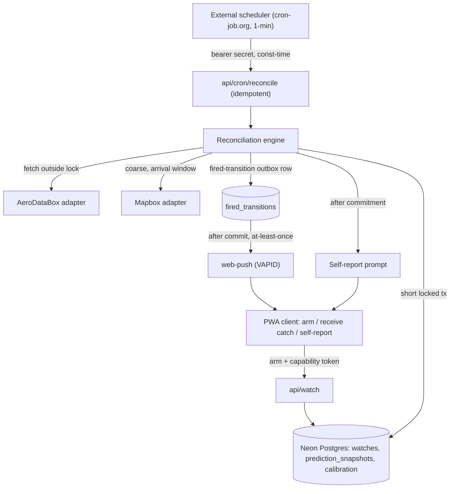
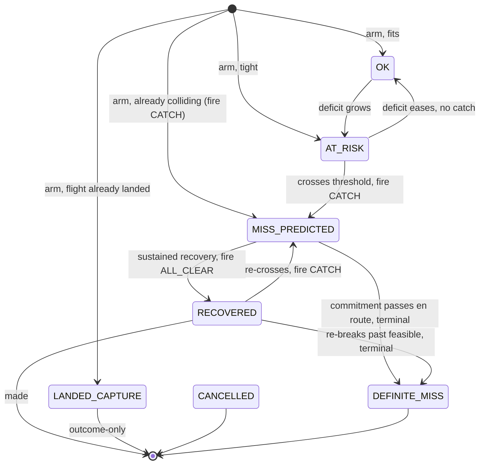

# feat: Reconciliation walking skeleton (Slice 1)

## Summary

Build the thinnest end-to-end reconciliation loop on a greenfield Next.js + Vercel stack: arm a watch over one flight (AeroDataBox) and one manually-entered timed commitment, detect a delay-driven collision with timezone-correct interval arithmetic, push an advisory "catch" (Web Push / VAPID), and log an append-only prediction-vs-outcome record per watch from the first trip. Detect-and-advise only, no auto-fix, no LLM.

---

## Problem Frame

The product's wedge is real-time reconciliation and its only durable moat is the calibration corpus of logged prediction-vs-outcome data (see origin: docs/brainstorms/2026-06-05-reconciliation-slice-1-requirements.md). Neither is exercised by flight tracking alone — a tracked flight with nothing downstream has nothing to collide with. This slice puts the smallest real collision in front of the engine so the detect→advise→log loop runs end-to-end and the telemetry that seeds the moat records from trip one. Manual single-commitment entry caps volume on purpose; this slice proves value, not scale.

Research turned three brainstorm assumptions into firm constraints: Vercel's free cron fires only once a day (so polling cannot live in native cron), standard Web Push + VAPID covers all browsers without Firebase, and timezone handling is the load-bearing correctness risk. A deepening review added three more: the calibration shape must be append-only or it silently truncates the moat, the watch owner must be a stable key (not the rotating push subscription), and the public quota-spending endpoints need an authorization and abuse model before they ship.

---

## High-Level Technical Design

One reconciliation transaction per watch is the unit of correctness. The engine fetches fresh flight + transit data **outside** any lock, then opens a short transaction to re-read state, advance the state machine, append a prediction snapshot, and insert a fired-transition outbox row — all committing together. The push send happens after commit, at-least-once, keyed off the outbox row, because an external HTTP push can never be atomic with a DB commit.



The per-watch state machine makes "fire on transition, not condition" explicit. The transition table in U6 is authoritative; this diagram illustrates the main edges. `CANCELLED` and `DEGRADED` are **global transitions reachable from any live state** (OK, AT_RISK, MISS_PREDICTED, RECOVERED). `DEGRADED` re-enters at the verdict fresh data implies (OK / AT_RISK / MISS_PREDICTED) or a terminal — it never auto-fires `DEFINITE_MISS` from missing data, since asserting a definite miss you cannot observe is the same false-confidence failure `DEGRADED` exists to prevent.



---

## Key Technical Decisions

- Web Push + VAPID, not FCM. One code path across Chrome/Firefox/Edge/Safari with no Firebase lock-in (see origin). Only `VAPID_PUBLIC_KEY` reaches the client; the private key signs sends server-side.
- External scheduler over Vercel cron. Vercel Hobby cron rejects anything finer than once/day; the poll loop is driven by an external 1-min scheduler (cron-job.org) hitting a secret-guarded route. QStash (signed callbacks + retries) or Vercel Pro is the upgrade path; the route stays scheduler-agnostic behind a single swappable guard.
- No accounts, but every resource is a capability. A device gets a stable client-generated `device_id` persisted in the PWA; each watch has an unguessable id and an owner capability token minted at arm time and required on every read/mutate. The push subscription is a **deletable delivery credential attached to the device, never the corpus owner** — so rotating/expiring it (404/410 cleanup) never orphans a watch or erases calibration history.
- Append-only calibration corpus, three tables. `watches` (live state) → `prediction_snapshots` (one row per reconcile: inputs, timestamps, verdict, fired-transition, dedup fingerprint) → `calibration` (one per watch: actual arrival, self-report, lifecycle). A flat one-row-per-watch shape would overwrite each prediction and silently truncate the time series that IS the moat.
- Data-derived idempotency. `revision` is a deterministic fingerprint of the load-bearing inputs (predicted arrival instant + status + transit bucket), not a tick counter. Dedup identity is `watchId : transition-edge : revision`, enforced by a unique constraint on `fired_transitions`; the unique insert is the commit point and gates the send (transactional outbox).
- Concurrency control. Fetch adapters outside any lock; then a short transaction re-reads state under `SELECT … FOR UPDATE SKIP LOCKED` (confirm the chosen Neon driver mode supports interactive row-lock transactions; otherwise compare-and-swap on `(state, revision)`). Dwell and recovery counters live inside this lock so overlapping ticks can't double-count.
- Reconciliation as a state machine with hysteresis + dwell. Fire on transition, not on "condition true." Two deadbands (OK↔AT_RISK and recovery) plus a 2-update dwell for recovery; cancellation and en-route-past-commitment are terminal. A stale feed past the freshness ceiling goes to `DEGRADED` and never asserts an outcome it can't observe.
- Timezone model. Flight arrival is a UTC instant (AeroDataBox `revisedTime.utc` predicted, `runwayTime.utc` actual); the commitment is stored as local wall-time + the IANA zone of the geocoded place; all collision math compares instants. Luxon (Safari ships no Temporal yet).
- Neon Postgres as system of record, via the serverless driver. Provenance columns (`margin_source`, `transit_source`) and explicit unknown members (`verdict ∈ {make, miss, indeterminate}`; outcome NULL unless `self_report_status = answered`) keep defaults and non-responses from masquerading as data.
- Transit re-fetch is coarse, not per-tick. Geocode once at arm; re-fetch the airport→place duration only inside the arrival window, cached on the watch. This keeps Mapbox off the correctness hot path and keeps `DEGRADED` single-sourced to the flight feed. Mapbox Directions (`driving-traffic`, 1×1), not Matrix.
- AeroDataBox polling, not webhook. Simpler and cheaper for one flight; self-throttle to the active window. The engine entry point accepts "here is a fresh flight datum for watch X" so a future webhook pushes into the same path. Webhook (Flight Alert API) is a later optimization.
- iOS requires an installable PWA. iOS web push works only from a home-screen-installed PWA (iOS 16.4+), gesture-triggered. Slice 1 ships a manifest + Add-to-Home-Screen flow or iPhone users get no catch.
- Public endpoints validate before they pay. Every public mutating route runs schema validation → rate-limit check → only then any metered Mapbox/AeroDataBox call; secrets are server-only and never logged.
- Deterministic, templated advice; no LLM. Collision detection is interval arithmetic; the "what to do" (including the recommended new time) is computed in the engine as a structured advice object that both the push and the dashboard render, so they never drift. Branches on the reschedulable flag (see origin).

---

## Requirements

Carried from origin (R1–R16) and extended with research- and review-driven requirements (R17–R26).

**Trip setup (ingestion)**

- R1. The traveler can arm a watch by entering one flight (number + date) and one timed commitment (time, place, arrival margin, reschedulable flag, optional contact).
- R2. On arming, the system tracks the flight via AeroDataBox and computes airport→place transit via a single Mapbox lookup; an unresolvable place falls back to a manual buffer recorded as such.
- R3. Slice 1 supports exactly one active flight and one commitment per watch; arming the same flight+commitment from the same device is idempotent.

**Reconciliation**

- R4. The engine predicts a collision when (flight estimated-arrival + fixed egress allowance + transit) exceeds (commitment time − arrival margin), recomputing on each flight-status update.
- R5. The engine maintains a current make/miss/indeterminate prediction and the slack or deficit from arming through the commitment time.
- R6. A cancellation, or a delay past any feasible arrival, is a definite miss; a feed that cannot be observed yields indeterminate, never a definite miss.

**Advice and notification**

- R7. When the prediction first flips to miss (beyond an anti-flap threshold), a catch fires on push stating what broke and what to do.
- R8. The advice branches on the reschedulable flag: reschedulable → contact the place and push to a computed realistic time; fixed → state the commitment is likely lost and the cancellation/exchange window.
- R9. If a fired miss later recovers (sustained beyond the recovery band), a recovery update fires.
- R10. Slice 1 never acts on the traveler's behalf — it only advises.

**Telemetry and calibration**

- R11. Every watch writes a calibration record at arm time; each reconcile appends a prediction snapshot; clean trips are recorded too.
- R12. Each snapshot captures its inputs (estimated arrival, egress allowance, transit used, margin, resulting slack/deficit), provenance of the buffers used, the verdict, whether a transition fired, and timestamps.
- R13. The calibration record captures the actual flight arrival from AeroDataBox actuals, written first-write-wins.
- R14. After the commitment time, a single self-report captures made/missed/changed and whether the heads-up was useful; an unanswered prompt is recorded as missing (explicit status), not a failure and never coerced to "missed."
- R15. The calibration record is produced in Slice 1 even at tiny n.
- R16. The slice records the STRATEGY.md metrics from v1: thesis-exercising trips created, cascade-alert usefulness rate with its denominator (cascade events observed), first-useful-catch rate, and prediction-vs-outcome accuracy.

**Correctness, integrity, and security (review-driven)**

- R17. All collision arithmetic compares UTC instants; the commitment is stored as local time plus the IANA zone derived from the geocoded place, and the resolved zone is shown at arm time.
- R18. A flight feed that goes stale past a freshness ceiling, errors, or rate-limits moves the watch to `DEGRADED` ("can't confirm your flight") rather than implying on-time.
- R19. Arm-time validation rejects past or impossible commitments and routes an already-landed flight to outcome-capture-only.
- R20. The reconcile endpoint is idempotent and authenticated by a shared secret compared in constant time; the meaningful idempotency is per-watch-effect (the fired-transition unique constraint), not just route-level.
- R21. Push delivery status (attempting → sent / failed / no-device) is recorded per fired transition; expired subscriptions (HTTP 404/410) are deleted without touching the calibration rows that reference the device.
- R22. Each catch records its lead time and a `useful_lead` flag so first-useful-catch counts only delivered AND actionable catches.
- R23. Every watch has an unguessable id and an owner capability token minted at arm; all watch reads/mutations (including self-report) require it. The push subscription is a deletable delivery credential, never the corpus owner.
- R24. Public mutating routes are rate-limited and validated before any paid upstream call; active watches per device are capped and expire; a budget circuit-breaker sheds new arms on quota exhaustion.
- R25. Only `VAPID_PUBLIC_KEY` is browser-exposed; all other secrets are server-only and never logged (tokens scrubbed from any logged URL).
- R26. The calibration corpus is append-only: prediction snapshots are never overwritten; provenance (`margin_source`, `transit_source`) and explicit unknowns (`verdict = indeterminate`, NULL outcome under non-answer) are recorded so defaults and non-responses never masquerade as data.

---

## Output Structure

Greenfield layout (directional — the implementer may adjust):

```text
app/
  page.tsx                     # arm-a-watch form
  dashboard/page.tsx           # unified watch + status mirror
  api/
    watch/route.ts             # create/read a watch (capability-checked)
    cron/reconcile/route.ts    # secret-guarded reconcile tick
    push/subscribe/route.ts    # store/refresh PushSubscription
    self-report/route.ts       # capture made/missed/useful (capability-checked)
middleware.ts                  # rate-limit, origin allowlist, security headers
lib/
  engine/                      # time, collision, state, reconcile, validation, constants
  adapters/                    # aerodatabox, mapbox
  push/                        # VAPID send, outbox dispatch, subscription cleanup
  calibration/                 # sole writer: snapshots, outcome, backfill, metrics
  security/                    # ratelimit, headers, capability tokens
  db/                          # schema + serverless client
public/
  sw.js                        # service worker (push + actions)
  manifest.webmanifest         # PWA install
```

---

## Implementation Units

### Phase A — Foundation

### U1. Project scaffold, persistence, identity, and secrets

- Goal: Stand up the project, the Neon connection (serverless driver), and the three-table schema with identity, provenance, and integrity constraints baked in.
- Requirements: R3, R11, R20, R23, R25, R26.
- Dependencies: none.
- Files: `package.json`, `next.config.ts`, `tailwind.config.ts`, `.gitignore`, `lib/db/index.ts`, `lib/db/schema.sql`, `lib/security/capability.ts`, `.env.example`.
- Approach: Define `watches` (unguessable id, `device_id`, owner capability token hash, flight number+date, commitment local-time + IANA zone, place coords, `place_resolved`, margin + `margin_source`, transit + `transit_source`, reschedulable, contact, current state, revision, `next_poll_at`, lifecycle) with the arm-time-known columns NOT NULL and a unique partial index on `(device_id, flight, date, commitment_instant)` over non-terminal states. `prediction_snapshots` (FK to watch, fetched-at, predicted arrival instant, transit/egress/margin used, slack, `verdict ∈ {make,miss,indeterminate}`, resulting state, fired-transition, dedup fingerprint, unique on `(watch_id, revision)`). `fired_transitions` (watch, transition edge, revision, delivery status) unique on the dedup tuple. `calibration` (one per watch: actual arrival, `diverted_to_airport`, self-report outcome/was_useful, `self_report_status ∈ {pending,answered,dismissed,expired,no_channel}`, enrichment lifecycle). Connect via `@neondatabase/serverless`. `.gitignore` covers `.env*` from the first commit; `.env.example` lists `DATABASE_URL`, `CRON_SECRET`, `VAPID_PUBLIC_KEY`, `VAPID_PRIVATE_KEY`, `VAPID_SUBJECT`, `AERODATABOX_KEY`, `MAPBOX_TOKEN` with a note that only the VAPID public key is browser-exposed.
- Patterns to follow: none (greenfield — this unit sets the conventions: unguessable ids, parameterized SQL only, server-only secrets).
- Test scenarios: Test expectation: none -- scaffolding and schema. Verify migrations apply, the unique indexes reject duplicates, and a transaction with a row lock round-trips on the chosen driver mode.
- Verification: App boots; seed inserts honor NOT NULL and unique constraints; a `FOR UPDATE` transaction holds across statements (or CAS fallback is chosen and noted).

### U2. Timezone-correct collision core

- Goal: Pure functions for the deterministic verdict, correct across timezones, DST, overnight, and date-line cases.
- Requirements: R4, R5, R17, R26 (provenance of buffers used).
- Dependencies: U1.
- Files: `lib/engine/time.ts`, `lib/engine/collision.ts`, `lib/engine/constants.ts`, `lib/engine/__tests__/collision.test.ts`.
- Approach: Flight arrival as a UTC instant; commitment as `{ localWallTime, ianaZone }`. `predictedArrivalAtPlace = arrivalInstant + egressAllowance + transitDuration` (durations added to an instant, never to wall-clock). Verdict make/miss, or `indeterminate` when inputs are unobservable. Seed tunable constants: egress 35 min, default margin 0, OK↔AT_RISK band, anti-flap deficit 10 min, recovery band 10 min, dwell 2 updates, staleness ceiling 30 min, usable-lead 30 min. Carry the actual buffers and their provenance through so a later constant change never retro-rewrites past predictions. Take the full arrival timestamp from the adapter; never reconstruct it from the entered departure date.
- Patterns to follow: none; engine foundation.
- Execution note: Write the test matrix first — the highest-risk correctness surface.
- Test scenarios:
  - Same-zone delay past the deadline → miss. Covers AE1.
  - Cross-zone: verdict uses instants, not wall-clock offsets.
  - DST straddle: commitment local time on the far side resolves to the correct instant.
  - Overnight / red-eye: arrival date correct.
  - Date-line westbound: arrival "earlier" in local clock doesn't break the comparison.
  - Boundary: arrival exactly at the deadline (document inclusive/exclusive).
  - Unobservable inputs → `indeterminate`, not a default make.
- Verification: Matrix passes under a UTC clock (CI) and a DST-observing local clock.

### Phase B — Ingestion

### U3. AeroDataBox flight adapter

- Goal: Fetch a flight by number + date and expose typed status: scheduled/estimated/actual arrival (UTC), cancellation, diversion/arrival airport, freshness.
- Requirements: R2 (flight side), R6, R13, R18.
- Dependencies: U1.
- Files: `lib/adapters/aerodatabox.ts`, `lib/adapters/__tests__/aerodatabox.test.ts`.
- Approach: Map `arrival.revisedTime.utc` → predicted, `arrival.runwayTime.utc` → actual, status → cancelled/diverted, plus arrival airport and a `fetchedAt`. Return a discriminated result (ok / not-found / rate-limited / error) and a stable `revision` fingerprint derived from the load-bearing fields. Confirm the endpoint's unit tier in the dashboard before fixing cadence (plan for 2-unit). Never let an upstream URL with a token reach a log.
- Patterns to follow: the discriminated-result shape becomes the convention for U4.
- Test scenarios:
  - Parses predicted vs actual from the time objects; uses `.utc`.
  - Cancelled → definite-miss signal. Covers AE3.
  - Diverted / changed arrival airport surfaced, not dropped.
  - 429 / 5xx → typed error results, not exceptions; revision stable across identical polls.
- Verification: Tests against fixtures for predicted, landed, cancelled, diverted, and error payloads.

### U4. Mapbox geocode + transit adapter

- Goal: Resolve the place to coordinates + IANA zone and compute airport→place duration; distinguish failure reasons; never trust the input string raw.
- Requirements: R2 (transit side), R17 (zone source), R26 (transit provenance).
- Dependencies: U1.
- Files: `lib/adapters/mapbox.ts`, `lib/adapters/__tests__/mapbox.test.ts`.
- Approach: URL-encode and length-cap the place string before the request. Geocode → coordinates + derived destination IANA zone + `place_resolved` confidence flag. Duration via Directions (`driving-traffic`, single origin→destination). Distinguish geocode-miss, ambiguous (low confidence), and unroutable for the corpus. On a hard miss/unroutable, signal the manual-buffer fallback (`transit_source = manual_buffer`). Slice 1 surfaces the single resolved place + zone for arm-time confirmation; a multi-candidate picker is deferred.
- Patterns to follow: U3 discriminated result.
- Test scenarios:
  - Clean place → coordinates + zone + duration (`transit_source = mapbox`, `place_resolved = true`).
  - Zero-result → manual-buffer fallback (`place_resolved = false`). Covers AE4.
  - Geocoded-but-unroutable → fallback with a distinct logged reason.
  - Zone derivation returns the destination zone, not device or airport.
  - Oversized/encoded-injection place string is capped/encoded, not passed raw.
- Verification: Tests against fixtures for success, miss, unroutable, and a hostile input string.

### U5. Arm a watch (API + form + validation + ownership)

- Goal: Create a watch transactionally, validate inputs, mint the capability token, resolve flight + transit, and establish the baseline — without paying upstream before validation.
- Requirements: R1, R3, R19, R23, R24 (validate-before-pay ordering).
- Dependencies: U2, U3, U4.
- Files: `app/page.tsx`, `app/api/watch/route.ts`, `lib/engine/validation.ts`, `lib/engine/__tests__/validation.test.ts`.
- Approach: Order: zod-validate → rate-limit/cap check → only then geocode + flight lookup. Reject a past commitment or one preceding earliest-feasible arrival with a clear message; route an already-landed flight to `LANDED_CAPTURE` (outcome-only). Wrap {watch insert + initial `calibration` row} in one transaction; run the first reconcile pass after commit so a flaky upstream can't leave a half-armed watch. Mint the owner capability token, return it once, store only its hash. An "already colliding at arm" baseline arms directly into `MISS_PREDICTED` and fires the catch (the catch is the value). Show resolved place, zone, and transit for confirmation.
- Patterns to follow: U3/U4 results; U2 verdict.
- Test scenarios:
  - Valid arm, fitting commitment → `OK` baseline, calibration row written, no catch. Covers AE5 setup.
  - Already-colliding-at-arm → `MISS_PREDICTED` + catch, not a silent state.
  - Past commitment / commitment before feasible arrival → rejected with a reason. Covers AE7.
  - Already-landed flight → `LANDED_CAPTURE`.
  - Duplicate arm of the same flight+commitment from one device → idempotent (no second watch/row).
  - Validation failure / over-cap → rejected before any Mapbox/AeroDataBox call.
- Verification: Arming creates exactly one watch + calibration row and returns a capability token; invalid or abusive arms are refused without spending quota.

### Phase C — Reconcile

### U6. Reconciliation engine and state machine

- Goal: Run one idempotent, concurrency-safe reconciliation per watch: recompute, advance the state machine, append a snapshot, and record a fired transition.
- Requirements: R4, R5, R6, R7, R9, R12, R18.
- Dependencies: U2, U3, U4.
- Files: `lib/engine/reconcile.ts`, `lib/engine/state.ts`, `lib/engine/transitions.md`, `lib/engine/__tests__/reconcile.test.ts`, `lib/engine/__tests__/state.test.ts`.
- Approach: Entry point accepts a fresh flight datum for a watch (so a future webhook reuses the path). Fetch adapters outside any lock; transit only when inside the arrival window (cached otherwise). Then a short transaction: `FOR UPDATE SKIP LOCKED` (or CAS on `(state, revision)`), re-read state, compute the verdict, apply the transition table, append a `prediction_snapshot` (idempotent on `(watch_id, revision)`), and on a firing edge insert a `fired_transitions` row (unique on the dedup tuple) — the unique insert is the commit gate. Maintain the authoritative transition table in `transitions.md` enumerating from-state, to-state, guard, notification, dwell; `CANCELLED`/`DEGRADED` are global from any live state; `DEGRADED` re-enters at the fresh verdict and never auto-fires `DEFINITE_MISS`. Dwell and recovery counters live inside the lock.
- Patterns to follow: U2 verdict, U3/U4 results.
- Test scenarios:
  - First threshold cross → one CATCH; further worsening while in miss → no repeat catch. Covers AE9.
  - Sustained recovery beyond the band → one ALL_CLEAR; a dip back within dwell → suppressed. Covers AE2.
  - `AT_RISK → OK` when deficit eases (no catch).
  - Cancellation from any live state → terminal definite-miss catch. Covers AE3.
  - Commitment passes while en route → `DEFINITE_MISS`; row stays open for actual backfill.
  - Stale feed past ceiling → `DEGRADED`; stale feed AND commitment time passes → stays `DEGRADED`, no false definite-miss. Covers AE8.
  - Two concurrent reconciles of the same watch at the same revision → exactly one fired transition and one snapshot (idempotent under overlap, not just sequential replay).
- Verification: Every transition-table edge has a test; concurrent and replayed ticks are no-ops beyond the first.

### U7. Scheduler trigger and reconcile route

- Goal: A secret-guarded, idempotent endpoint the external scheduler calls; it selects due watches, runs U6 for each, and bounds its own work.
- Requirements: R4 (cadence), R20, R24 (per-tick ceiling).
- Dependencies: U6.
- Files: `app/api/cron/reconcile/route.ts`, `lib/scheduler/select.ts`, `lib/scheduler/__tests__/select.test.ts`.
- Approach: Reject requests without the bearer `CRON_SECRET`, compared in constant time. The selector is a dumb `WHERE next_poll_at <= now()` query; the reconcile transaction computes and persists each watch's `next_poll_at` and back-off (so policy stays out of the scheduler and the route stays scheduler-agnostic). Cap watches processed per invocation (most-due first) and enforce a global per-tick upstream-call ceiling so a replayed/forged authorized call can't fan out unboundedly. A watch that errors does not abort the batch.
- Patterns to follow: U6 transaction.
- Test scenarios:
  - Missing/incorrect secret → rejected via constant-time compare.
  - Only due watches processed; far-from-window watches skipped.
  - Per-invocation cap honored; one erroring watch doesn't abort the batch.
  - A replayed authorized call finds nothing due and does no upstream work.
- Verification: An authorized call processes due watches and advances `next_poll_at`; an unauthorized or replayed call spends no quota.

### Phase D — Advise and calibrate

### U8. Web push delivery and the catch

- Goal: Subscribe devices (incl. the iOS PWA path), dispatch the catch from the outbox at-least-once, and keep subscriptions and the VAPID split healthy.
- Requirements: R7, R8, R10, R21, R25.
- Dependencies: U1, U6.
- Files: `public/sw.js`, `public/manifest.webmanifest`, `lib/push/dispatch.ts`, `lib/push/template.ts`, `app/api/push/subscribe/route.ts`, `components/InstallPrompt.tsx`, `lib/push/__tests__/template.test.ts`.
- Approach: Generate VAPID keys once; the public key is the client `applicationServerKey`, the private key signs sends server-side only. Register a service worker with a `push` handler and action buttons. Request permission on a user gesture; detect non-installed iOS (`display-mode` not standalone) and show the Add-to-Home-Screen prompt instead of a dead subscribe button. Validate the subscription `endpoint` against a known push-service host allowlist and key format before storing. Dispatch reads unsent `fired_transitions` after commit, marks `attempting` → sends via `web-push` with `Urgency: high` and a lead-time-sized TTL → updates `sent`/`failed`/`no-device`; on 404/410 delete the subscription (not the calibration rows). Render from the engine's structured advice object (reschedulable → realistic new time + contact; fixed → likely-miss + window); mirror every catch on the dashboard.
- Patterns to follow: the outbox rows from U6.
- Test scenarios:
  - Reschedulable → advice names a computed realistic new time + contact. Covers AE1.
  - Fixed → likely-miss + window.
  - 404/410 on send → subscription deleted, delivery `failed`, calibration intact.
  - No registered device → `no-device`, dashboard still updated.
  - iOS non-PWA context → install prompt, no broken subscribe.
  - Malformed/non-allowlisted endpoint → rejected at subscribe.
- Verification: A fired transition dispatches once, records a terminal delivery status, and never double-sends; a dead subscription is pruned without data loss.

### U9. Calibration outcome capture (sole writer)

- Goal: Complete the per-watch calibration record — flight-actual backfill and a one-tap self-report — through a single writer that owns the row's invariants.
- Requirements: R11, R13, R14, R15, R22, R26.
- Dependencies: U6, U8.
- Files: `lib/calibration/writer.ts`, `lib/calibration/backfill.ts`, `app/api/self-report/route.ts`, `lib/calibration/__tests__/writer.test.ts`.
- Approach: `lib/calibration` is the sole writer (typed `appendSnapshot` / `recordDelivery` / `backfillActual` / `recordSelfReport`); other units call it, never issue their own SQL. All writes are column-scoped partial UPDATEs (never round-trip the whole row). Backfill the actual first-write-wins (`WHERE actual_arrival IS NULL`); a differing airport writes `diverted_to_airport`, not a mutation. Self-report fires ~15–30 min after the commitment via notification actions (Made it / Missed it / Changed it) + optional "useful?"; `self_report_status` starts `pending`, the expiry sweep moves `pending → expired` only, and a late answer either wins (`expired → answered`) or is rejected per a documented rule. The self-report route is capability-checked. Tag each fired transition with `lead_time` and `useful_lead`. Lifecycle sealing marks a row final so metrics can distinguish "not yet enriched" from "genuinely unknown."
- Patterns to follow: U8 notification actions; U6 snapshots.
- Test scenarios:
  - Clean trip → predicted-make / made recorded; self-report still runs. Covers AE5.
  - Unanswered prompt → `self_report_status = expired`, outcome NULL, flight-actual still recorded. Covers AE6.
  - Self-report answered before the flight lands → outcome saved now, actual backfilled later (no null clobber).
  - Late/revised actual → first real actual wins; diversion writes `diverted_to_airport`.
  - Self-report POST without a valid capability token → rejected.
  - Concurrent backfill + self-report → column-scoped writes don't clobber.
- Verification: A row reaches its sealed state across arm → land → self-report; non-response leaves explicit NULLs + status, never sentinels; no cross-writer clobber.

### U10. Metrics and unified dashboard

- Goal: Define and record the four strategy metrics precisely, and show the watch + status as the in-app mirror.
- Requirements: R16, R22.
- Dependencies: U9.
- Files: `lib/calibration/metrics.ts`, `app/dashboard/page.tsx`, `lib/calibration/__tests__/metrics.test.ts`.
- Approach: Pin definitions — thesis-exercising trips require `place_resolved AND commitment_instant`; cascade-alert usefulness = (catches with `useful_lead OR was_useful`) / (fired CATCH rows), recovery/degraded notices excluded, always returned with the denominator; first-useful-catch = `MIN(fired_at) WHERE delivery_status = sent AND useful_lead` per device; prediction-vs-outcome accuracy split into flight-prediction accuracy (predicted vs actual arrival instant, independent) and outcome accuracy (verdict vs self-reported made/missed, only when answered) — never synthesize outcome accuracy from the model's own egress/transit; exclude `indeterminate` verdicts and report the exclusion count. Metrics read only sealed rows. The dashboard is capability-gated, escapes all user text, and shows state, resolved place/zone/transit, and catch history (the reliability backstop for undelivered push).
- Patterns to follow: U9 writer API.
- Test scenarios:
  - Usefulness rate returned with denominator; zero events → reported low-n, not 0%.
  - First-useful-catch excludes undelivered and below-lead-threshold catches.
  - Thesis-exercising requires a resolved place + time.
  - Accuracy excludes `indeterminate` and never grades the model against its own assumptions.
- Verification: Metrics compute correctly off seeded snapshots/outcomes; the dashboard renders a watch's full lifecycle and rejects access without a capability token.

### Phase E — Cross-cutting

### U11. Abuse controls and security headers

- Goal: Bound the public attack/cost surface — rate limits, validate-before-pay, watch caps, a budget circuit-breaker, and baseline headers.
- Requirements: R24, R25.
- Dependencies: U1.
- Files: `middleware.ts`, `lib/security/ratelimit.ts`, `lib/security/headers.ts`, `lib/security/__tests__/ratelimit.test.ts`.
- Approach: Upstash Redis as the rate-limit/abuse store (promoted from optional). Every public mutating route: validate → rate-limit (by IP and, where present, device) → only then any paid call. Cap active watches per device with a TTL so abandoned watches age out. A budget circuit-breaker sheds new arms when monthly Mapbox/AeroDataBox spend crosses a threshold (reusing the `DEGRADED` honest-failure posture). Baseline headers — strict CSP, HSTS, `X-Content-Type-Options`, `Referrer-Policy` — and an Origin allowlist on mutating routes. Keep the capability token header-sent (not a cookie), or `SameSite=Strict; Secure; HttpOnly` if cookied.
- Patterns to follow: none; sets the security baseline.
- Test scenarios:
  - Rate limit trips after N creates per IP/hour; over-limit requests make no upstream call.
  - Circuit-breaker sheds new arms past the budget threshold; existing watches still reconcile.
  - Wrong/missing `CRON_SECRET` rejected via constant-time compare.
  - Security headers and Origin allowlist present on mutating responses.
- Verification: An abuse flood is rejected without spending upstream quota; headers and origin checks are enforced.

---

## Acceptance Examples

Carried from origin (AE1–AE6) and extended by the flow-gap analysis (AE7–AE9).

- AE1. Delay causes a miss → catch with what-broke + what-to-do; prediction snapshot written.
- AE2. Delay then recovery → recovery update fires once; both predictions logged as distinct snapshots.
- AE3. Cancellation → catch states the commitment is lost; logged as a definite miss.
- AE4. Geocoding hard-fails → traveler enters a manual buffer (`transit_source = manual_buffer`); the watch proceeds.
- AE5. Clean trip → no catch, self-report still runs, predicted-make/made recorded.
- AE6. Self-report ignored → flight-actual recorded, self-report marked `expired`.
- AE7. Invalid/degenerate input (past commitment, commitment before feasible arrival, already-landed flight) → rejected or routed, never silently collided.
- AE8. Feed goes stale mid-watch → `DEGRADED` "can't confirm," not false reassurance; even when the commitment time passes, no false definite-miss.
- AE9. Flapping within the hysteresis band → exactly one catch fires, not one per update.

---

## Scope Boundaries

**Deferred for later** (carried from origin)

- Confirmation parsing and automatic ingestion (Slice 2 — addresses the manual-entry volume cap).
- Multiple commitments and multi-leg trips.
- LLM advice enrichment and outreach drafting.
- Hotel check-in windows as a commitment type; an arrival-margin / archetype library.

**Outside this product's identity** (carried from origin)

- Auto-fix / write-access actions (rebooking, moving reservations) — detect-and-advise only.
- AI itinerary generation.
- Hotel / POI inventory APIs; live flight map.
- Group editing / collaboration — family is the alert audience, not a co-editor.

**Deferred to Follow-Up Work** (plan-local)

- Full multi-candidate geocode disambiguation picker (Slice 1 confirms the single resolved place at arm time).
- Diversion re-geocode from the new airport (Slice 1 detects a diversion and degrades to a "transit unknown" honest catch; it records `diverted_to_airport`).
- Recovery out of cancelled/definite-miss (terminal in Slice 1).
- AeroDataBox webhook (Flight Alert API) in place of polling; QStash/Vercel Pro scheduler and HMAC-signed-request guard.
- Bot challenge (Turnstile) on the arm form; full account model (the capability token is the seam it grafts onto).
- Traffic-aware continuous transit re-routing; international egress/customs modeling; multi-channel notifications; retention/auto-purge of completed watches beyond the v1 TTL.

---

## Risks & Dependencies

- Calibration shape is corpus-fatal if flat. A one-row-per-watch shape silently overwrites each prediction and loses the time series — the moat. Mitigated by the append-only `prediction_snapshots` table (KTD, R26).
- Subscription rotation/deletion. Browsers rotate/expire push subscriptions; if the subscription owned the watch, the 404/410 cleanup would orphan it mid-trip and could erase calibration history. Mitigated by the stable `device_id` + capability token; the subscription is a deletable credential (KTD, R23).
- Quota / storage DoS on public endpoints. Unauthenticated arm spends Mapbox + AeroDataBox quota and adds reconcile load. Mitigated by validate-before-pay ordering, rate limits, per-device watch caps, and a budget circuit-breaker (R24, U11).
- Calibration-integrity attack. The moat is the highest-value target; unauthenticated self-report writes would poison it at small n. Mitigated by the capability-token ownership check (R23).
- Secret leak. A leaked VAPID private key lets anyone push as the app to every subscription (a branded phishing channel); a leaked Mapbox token bills the account. Mitigated by the secret boundary and token-scrubbed logs (R25).
- The load-bearing bet. The thesis depends on AeroDataBox delivering delay signal with usable lead time. If it doesn't, Slice 1's honest output is a negative result — the snapshots' `lead_time` distribution is the evidence to watch.
- Web push is best-effort. No delivery or timing guarantee; the dashboard mirror is the backstop and the TTL is sized to the lead time.
- iOS reach. Catches reach iPhone users only via an installed PWA; some EU/DMA states remove PWA web push — verify for launch geos.
- AeroDataBox unit tier unconfirmed. Confirm the flight-status endpoint's per-call unit cost before fixing cadence; self-throttle either way.
- Concurrency on the serverless driver. Confirm `@neondatabase/serverless` holds an interactive transaction with a row lock in the chosen mode; if not, fall back to CAS on `(state, revision)`.
- Mapbox ToS. Persisting Temporary-geocoder coordinates is ToS-gray; treat stored coords as derived, not a re-served cache.

---

## Open Questions

Deferred to implementation:

- Final tuned values for the seeded constants (egress, margin, both hysteresis bands, dwell, staleness ceiling, usable-lead) and the rate-limit / watch-cap thresholds — start conservative, tune against real catches and abuse signal.
- The late-self-report rule: does an answer after expiry win or get rejected?
- Whether to adopt the AeroDataBox webhook once more than one flight is watched.
- EU/DMA iOS web-push status for the intended launch geographies.

---

## Sources / Research

- Vercel cron tiers (Hobby = once/day) and Fluid Compute durations — the constraint behind the external-scheduler decision.
- AeroDataBox time fields: `revisedTime` (predicted) vs `runwayTime` (actual), each `.utc`/`.local`; Flight Alert (push) API exists but polling is simpler for one flight.
- Web Push + VAPID covers all browsers; iOS requires an installed PWA (16.4+), gesture-triggered permission, and 404/410 subscription cleanup; only the VAPID public key is client-side.
- Timezone handling: store UTC instants + IANA zone, compare instants, add durations to instants; Luxon (Safari ships no Temporal yet).
- Notification/alerting design: state machine + hysteresis + dwell, dedup keys, transactional-outbox at-least-once send (overlapping serverless invocations are possible).
- Neon Postgres free tier with the serverless driver; Upstash Redis for rate-limiting and ephemeral poll/dedup state.
