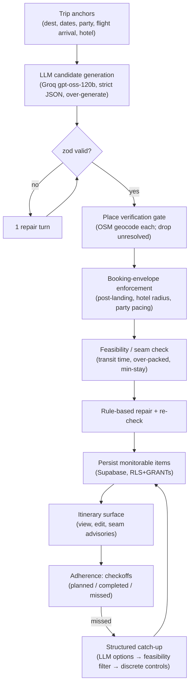

# feat: AI Trip Itinerary

> Origin requirements: `docs/brainstorms/2026-06-07-ai-itinerary-requirements.md` (shape **B + C**). Strategy: this is the reopened **"Plan-time itinerary (experimental)"** track in `STRATEGY.md` — sanctioned but explicitly *validate-demand-before-promoting*.

---

## Summary

Build an AI itinerary for the trips surface where the LLM is a **grounded candidate generator**, not the planner of record. It proposes candidate places + pacing; deterministic gates then **verify each place against the geocoder** (unresolved items are dropped — the monitorability gate), **enforce the booking-anchored time-space envelope** (nothing before the flight lands; arrival-day items near the hotel), **collide-check the plan** for fragile seams, and **repair by rule**. The result is a day-by-day plan where every item resolves to a real time and place. During the trip the user checks items off; missed items trigger a **structured, option-based catch-up** (never a chat box) that offers only feasibility-validated reschedules. Planned-vs-actual is recorded as a signal.

The architecture is forced by research: an un-gated LLM scores ~0.6% on end-to-end trip planning and invents places; deterministic gates around it reach ~97% (see Sources). The gates are also what keep this on-thesis — without them it collapses into the commodity `STRATEGY.md` rejected.

---

## Problem Frame

Today `app/trips/page.tsx` shows ingested items (live flight, hotel, attachments), but the user assembles the day-of plan elsewhere (ChatGPT, blogs). Keeper never sees those plans, so they are never monitorable and the engine has nothing downstream to collide-check — the trip scores zero on the **"thesis-exercising trips created"** steer metric. This feature converts loose intent into monitorable, booking-anchored items, making itinerary generation an *activation on-ramp* for the moat rather than a generic recommender.

**In scope:** booking-anchored generation, the monitorability gate, plan-time seam-check, structured itinerary surface, completion tracking, structured catch-up, planned-vs-actual capture.
**Not in scope (carried from origin — see Scope Boundaries):** booking execution, generic untethered recommendations, group editing, in-trip live replanning.

---

## Requirements

Carried from origin (`see origin`); R-IDs match the requirements doc.

| ID | Requirement | Units |
|----|-------------|-------|
| R1 | Generate a day-by-day itinerary anchored to known bookings | U2, U4, U6 |
| R2 | Respect hard constraints from bookings (post-landing, arrival-day-near-hotel, last-day-before-departure) | U4 |
| R3 | Every item carries time + geocodable place; free-text items not produced | U1, U3 |
| R4 | Accept / edit / remove / regenerate; accepted items persist | U6, U7 |
| R5 | Collide-check the timeline; flag fragile seams as advisories (never auto-fix) | U5, U7 |
| R6 | Ground in real geocodable places; unresolved → not monitorable | U3 |
| R7 | Sparse-trip graceful degradation; mark assumed anchors | U4, U6 |
| R8 | Make monitorability legible ("watched by Keeper") | U7 |
| R9 | Items are completable (checkoffs); capture planned-vs-actual | U8 |
| R10 | Missed items trigger a catch-up reconciling tomorrow vs. what slipped (advise only) | U8 |
| R11 | Catch-up is structured (discrete controls), not a chatbot | U8 |
| R12 | Record planned-vs-actual as a calibration signal | U1, U8 |

Success criteria (origin SC1–SC5) are measured post-ship; the plan wires the data to make them measurable (per-item monitorable flag → SC1/SC4; status field → SC5) but does not build analytics dashboards. **SC3** (seam-advisory usefulness) needs a capture point — add a `advisory_dismissed_at`/`acted_on` field + a dismiss action in U6/U7, or explicitly mark SC3 not-measurable in v1; do not imply it's measurable without the mechanism.

---

## Key Technical Decisions

### KTD1 — Data home: Supabase per-user space for v1 *(confirmed call-out)*
Itinerary data lives in a new Supabase table reached via the PostgREST/RLS client (`lib/itinerary/` mirroring `lib/trips/`), **not** the engine pooler DB (`lib/db/`). Rationale: the feature is experimental, the unified trip model doesn't exist yet, and the learnings explicitly warn to keep itinerary work out of the reconcile hot loop. This gets free per-user RLS (the `trip_attachments` precedent) and full decoupling — which also **soundly quarantines the reconciliation spine** (no reconcile-loop coupling; KTD7). **Strategic caveat (not just a data trade-off):** the live `calibration` corpus is `watch_id`-keyed flight outcomes (`made/missed/changed`) — an itinerary check-off has *no representation* there, and the bridge is blocked on the missing unified trip model. So in v1 the **moat-feeding half of the thesis is structurally inert**: v1 can validate the *activation* thesis (SC1/SC4 — monitorable items created) but **not** the *calibration* thesis. R12 is therefore demoted from "feeds the moat" to "**captures a planned-vs-actual signal we may later wire in**"; shape the `status` enum + timestamps so the future bridge is cheap. Migration path if promoted: move items to `lib/db/schema.sql` next to `calibration`. (see origin: OQ3)

### KTD2 — The LLM is a grounded candidate generator, gates are the planner *(the spine)*
The LLM proposes candidate place names + proposed times + pacing. It never has authority over: which places are real (U3 geocoder gate), whether an item fits the booking envelope (U4), or whether the plan is feasible (U5). Research is decisive that un-gated LLM planning fails on grounding, hard-constraint satisfaction, and feasibility — the exact three axes this feature sells. Repairs are **rule-based, never a re-prompt** (re-prompting introduces new violations).

### KTD3 — Groq via raw fetch, strict structured output, validate + one repair
Call `https://api.groq.com/openai/v1/chat/completions` with raw `fetch` (no new dependency — matches the "don't add packages" rule; `zod` 4.4.3 already present). Model `openai/gpt-oss-120b` with `response_format: json_schema, strict: true` (per Groq docs the `gpt-oss` models are the only tier that guarantees schema conformance; non-streaming, acceptable for one-shot generation). **Pin the model ID as a constant and verify it against Groq's live `/openai/v1/models` before launch** — model availability shifts (e.g. Kimi was deprecated → replaced by `gpt-oss-120b`). Defense-in-depth: `JSON.parse` → `zod.safeParse` → on failure, one repair turn feeding the error back → re-validate → typed error to UI. Lazy key read, keyless stub fallback for tests, `AdapterResult` return, 429 → read `retry-after` and back off once. `runtime: 'nodejs'`, `maxDuration = 60`, client-side `AbortController` ~60s. (see Sources: Groq structured outputs)

### KTD4 — Place verification = the monitorability gate (geocode-success, NOT fame) *(revised by U0)*
**U0 falsified the originally-planned gate** (`importance ≥ 0.3`): that threshold is a Wikipedia-fame prior borrowed from the airport-anchor use case, and it dropped 50–77% of *real* POIs (teamLab Borderless geocodes at importance `0.00009`), collapsing plans to landmarks — the rejected commodity (see `docs/u0-itinerary-grounding-probe.md`). The verifier is therefore: an item is **monitorable when it geocodes to a confident, correctly-named POI** — judged on Nominatim `place_rank`/`type`/`category` + an exact-name match, **not** on `importance`. The `importance ≥ 0.3` floor stays correct for the engine's airport anchor; it is **not** reused here. Query in the **local language** (the generator emits the local-language name; `"Museo Nacional de Antropología"` resolves where `"National Museum of Anthropology"` returns zero). An item that doesn't resolve is **dropped, not persisted**; the schema makes a free-text-only item *unrepresentable* (required `lat`, `lng`, `ianaZone`). Nominatim discipline: sequential ≤1 req/s, app-level `User-Agent`, cache + persist coords at generation time, ODbL attribution. Over-generate to backfill drops. **Follow-up:** anchor to stable POI IDs (Overture GERS / Google Places New) for durability. Re-run the corrected drop-rate probe; expect <40%. (see Sources: Overture/GEOHALUBENCH; U0 note)

### KTD5 — New pure feasibility checker; reuse engine vocabulary, don't overload `detectCollision`
`detectCollision` (`lib/engine/collision.ts`) is flight-arrival→commitment shaped; do not retrofit it. Build a new **pure** `lib/itinerary/feasibility.ts` reusing `lib/engine/time.ts`, the make/miss/slack vocabulary, the `Commitment` type, and `lib/engine/constants.ts` tuning — taking a general `(fromInstant, fromPlace, toItem, transitMinutes)` shape. Travel time is **tiered**: haversine pre-filter (cheap, but 3× error in cities → only a pre-filter), then OSRM point-to-point (`buildRouteUrl` in `lib/adapters/osm.ts`) on borderline legs only. Test-first like `lib/engine/__tests__/collision.test.ts`. (see Sources: Iti-Validator, Nextmv)

### KTD6 — Catch-up is option-based and structured, never a chat box
On a missed item, the LLM proposes candidate reschedule *options*; the feasibility checker (U5) filters them; the user picks via discrete controls (move / drop / swap / pick-slot). The UI never shows an option the validator would reject; invalid drop targets are visibly disabled. No free-text conversation surface. (see origin: KD6; Sources: ExploreLLM, Conversation Trap)

### KTD8 — Abuse, ownership, and data-handling floor *(from security review)*
The LLM actions are cost surfaces and the items are user data, so: (1) **per-user rate limit + idempotency** on both generate and catch-up actions (`@upstash/ratelimit`, already in the stack) — the cache stops re-compute, not abuse; (2) **`user_id` stamped server-side from `auth.uid()`** on insert (+ DB default), never from client payload; (3) every UPDATE/DELETE **filters by `id` AND `user_id`** (defense-in-depth beyond RLS); (4) **minimum-data to Groq** (city + dates + party, not the raw hotel address) and a UI disclosure that generation uses an external AI service; (5) **Nominatim `User-Agent` uses an app-level contact**, never a personal email; (6) LLM-sourced `title`/`place_name` are untrusted — zod max-length, React-escaped only, **no `dangerouslySetInnerHTML`**.

### KTD7 — Cache the generation call by normalized trip inputs
`next.config` has no `cacheComponents` flag, so use `unstable_cache` (matches `lib/trips/flight.ts`; deprecated in Next 16 but supported — migration to `use cache` is a follow-up). Key by a **normalized** trip-input object (sorted keys, lowercased dest, parsed ISO dates) so re-renders and `router.refresh()` don't burn Groq TPM; `revalidate` ~daily; bust on explicit regenerate. Generation is a **user-triggered action**, never called inside the reconcile cron.

---

## High-Level Technical Design

The generation pipeline — the LLM is one stage, bracketed by deterministic gates:



The seam advisories from **F** surface in the UI (**I**) as advice; they never auto-rewrite the plan (detect-and-advise).

---

## Output Structure

New feature module (mirrors `lib/trips/`), plus a migration and UI:

```
lib/itinerary/
  itinerary.ts        # leaf: types, zod schema, ItineraryItem, ItemStatus, enums, pure helpers (NO server imports)
  generate.ts         # Groq LLM adapter: candidate generation, AdapterResult, lazy key, stub fallback
  envelope.ts         # pure: derive + enforce booking time-space envelope
  feasibility.ts      # pure: seam-check + rule-based repair (reuses lib/engine/time.ts)
  constants.ts        # itinerary tuning (transfer-slack margin, max-items/day, min-stay) — NOT in lib/engine
  resolve.ts          # thin monitorability gate: parseGeocode + zoneFor + serial rate-limiter
  queries.ts          # server reads (directiveless): load itinerary for current user
  actions.ts          # "use server": generate, edit, complete, catch-up; ActionResult; revalidatePath
  __tests__/
supabase/migrations/
  20260608NNNNNN_itinerary_items.sql   # table + RLS owner_all + GRANTs
app/trips/itinerary/
  page.tsx            # itinerary surface (Server Component)
components/app/
  Itinerary.tsx           # "use client": view + structured edit controls
  ItineraryGenerate.tsx   # "use client": generate trigger + loading/error
  ItineraryCatchUp.tsx    # "use client": option-based catch-up
  itinerary.module.css
```

The per-unit **Files** lists are authoritative; the implementer may adjust layout.

---

## Implementation Units

Grouped into phases. U-IDs are stable. **Sequencing principle (from review):** this is an experiment whose own RK4 gates promotion on demand signal — so the cheapest demand/feasibility probes come *first*, and the heaviest, least-validated machinery is gated behind signal rather than built up front. The earliest demo-able generate→render slice should land before the full feasibility/catch-up systems.

### Phase 0 — De-risk spike (half-day, before any build commitment)

### U0. Grounding drop-rate + check-off feasibility probe
**Goal:** Falsify (cheaply) the two assumptions the whole bet rests on, before building the pipeline.
**Requirements:** de-risks R3/R6 (grounding) and R9 (adherence).
**Dependencies:** none.
**Files:** a throwaway script (not shipped) + a short findings note in `docs/`.
**Approach:** (1) **Drop-rate probe** — feed 50–100 LLM-generated candidate names across 3 real destinations through `parseGeocode` and measure the actual drop rate *and what survives*. Nominatim's importance floor (`CONFIDENCE_MIN = 0.3` in `lib/adapters/osm.ts`) is long-tailed: headline landmarks clear it, but the cafés/viewpoints/neighborhood spots that differentiate a plan resolve at ~0.1–0.25 and get dropped *en masse* — collapsing survivors to the same top-N monuments every generic planner returns. **Gate:** if drop >40% or survivors collapse to landmarks, generate-then-verify is falsified and **retrieval-first (Alternatives #2) leads instead** — a decision that's cheap now and a U2/U3/U6 rewrite later. (2) **Check-off feasibility** — a manual/Wizard-of-Oz read on whether users would tick items off in-trip (the product's own north star says in-trip opens may be *low* by design — `STRATEGY.md` diagnostic). **Gate:** Phase 4 (adherence/catch-up) is built only if this shows signal.
**Test scenarios:** none — `Test expectation: none — exploratory spike, output is a go/no-go note.`
**Verification:** a written go/no-go on (a) generate-then-verify vs retrieval-first and (b) build-Phase-4-now vs defer.

### Phase 1 — Foundation (data model, LLM adapter, monitorability gate)

### U1. Itinerary data model + migration + leaf types
**Goal:** Define the persistent shape and the client-safe types/zod schema so "free-text item" is unrepresentable.
**Requirements:** R3, R12.
**Dependencies:** none.
**Files:** `supabase/migrations/20260608NNNNNN_itinerary_items.sql`, `lib/itinerary/itinerary.ts`, `lib/itinerary/__tests__/itinerary.test.ts`.
**Approach:** Table `itinerary_items` (`id uuid pk`, `user_id text`, `day date`, `start_ts timestamptz`, `end_ts timestamptz`, `title text`, `place_name text`, `lat double precision`, `lng double precision`, `iana_zone text`, `kind text`, `status text default 'planned'`, `monitorable boolean`, `created_at`, `updated_at`). RLS `owner_all` (`auth.uid()::text = user_id`) **plus** `GRANT SELECT,INSERT,UPDATE,DELETE TO authenticated, service_role` (the load-bearing GRANT — RLS alone 403s; mirror `supabase/migrations/20260607151112_onboarding_grants.sql`). Index `(user_id, day)`. **`user_id` is always stamped server-side from the verified session (`auth.uid()`), never threaded from the action's argument** — add a DB `DEFAULT auth.uid()::text` (or BEFORE INSERT trigger) so the floor holds regardless of app code. Leaf `itinerary.ts`: `ItineraryItem` type, `ItemStatus` union (`planned|completed|missed|rescheduled`), `ItemKind` enum, the zod schema with **required** `lat`/`lng`/`iana_zone` (no nullable place) and **max-length bounds** on the LLM-sourced `title`/`place_name`, type guards. No server imports in the leaf.
**Patterns to follow:** `supabase/migrations/20260607185500_trip_attachments_and_storage.sql` (idempotent policies + GRANTs), `lib/trips/attachments.ts` (leaf module shape).
**Test scenarios:** zod schema rejects an item missing `lat`/`lng`/`iana_zone`; accepts a fully-resolved item; zod enforces max lengths on `title` (≤200) and `place_name` (≤300) — these are LLM-sourced untrusted strings; `ItemStatus` guard validates the four values and rejects others; migration SQL is idempotent (DROP POLICY IF EXISTS before CREATE). `Covers R3, R12.`
**Verification:** migration applies cleanly to a reset DB; `information_schema.role_table_grants` shows `authenticated` has DML; `tsc` clean.

### U2. LLM generation adapter (Groq)
**Goal:** Turn trip anchors into *candidate* items (place name + proposed time + kind), schema-valid, with no place trusted as real yet.
**Requirements:** R1.
**Dependencies:** U1.
**Files:** `lib/itinerary/generate.ts`, `lib/itinerary/__tests__/generate.test.ts`.
**Approach:** Raw `fetch` to Groq (`openai/gpt-oss-120b`, `response_format: json_schema, strict:true`), prompt carrying the anchors + an instruction to **over-generate** candidates. Each candidate carries its **local-language place name** + a coarse `type`/`category` (museum, restaurant, viewpoint, market…) so the U3 verifier can do a correct-named-POI match rather than a fame check (per U0). `resolveLlmProvider()` reads `GROQ_API_KEY`, falls back to a **keyless deterministic stub** for tests (the `lib/adapters/flight.ts` simulator pattern). Returns `AdapterResult<CandidatePlan>`. zod-validate the response; on failure run **one** repair turn; on repeated failure return `{kind:"error"}`. On HTTP 429 read `retry-after`, back off once, then `{kind:"rate_limited"}`. `AbortController` ~60s.
**Execution note:** Start with the stub-backed happy-path test, then the failure branches.
**Patterns to follow:** `lib/adapters/flight.ts` (`resolveProvider`, lazy key, `AdapterResult`, keyless fallback); `app/api/*/route.ts` (zod at the boundary).
**Test scenarios:** stub returns schema-valid candidates → `{kind:"ok"}`; malformed JSON → repair turn invoked, then ok; repair fails twice → `{kind:"error"}`; 429 → `{kind:"rate_limited"}` after one backoff; missing key in non-test → typed error, never throws; over-generation count honored. `Covers R1.`
**Verification:** all branches covered with the stub; no network in tests; `tsc` clean.

### U3. Place-verification / monitorability gate
**Goal:** Resolve each candidate place to coordinates + zone; drop anything unresolved so only monitorable items survive.
**Requirements:** R3, R6.
**Dependencies:** U1, U2.
**Files:** `lib/itinerary/resolve.ts` (thin gate helper), `lib/itinerary/__tests__/resolve.test.ts`.
**Approach (verifier revised by U0):** Geocode each candidate via Nominatim using its **local-language name** and keep it when it resolves to a **confident, correctly-named POI** — judged on `place_rank`/`type`/`category` + exact-name match, **not** on `importance ≥ 0.3` (U0 proved that floor drops most real POIs). `parseGeocode`'s `confident` flag (importance-based) is therefore **not** the gate; add a thin POI-confidence helper (or extend `osm.ts`) that returns the match quality this gate needs, attaching `lat`/`lng`/`iana_zone` (via `zoneFor`). Do **not** call `resolvePlace` (it forces an airport-anchored OSRM call this gate doesn't want). **Rate-limiting is an explicit serial loop with a ≥1000ms spacer between un-cached Nominatim hits** (cache hits skip the spacer) — `unstable_cache` is only the cross-request memo by normalized place string; it does not enforce the within-request 1 req/s discipline. Identifying app-level `User-Agent` (a project URL/support mailbox, **never a personal email**), defined as a named constant. **Bound over-generation** (cap candidates so worst-case geocode time stays well under the 60s window). Unresolved/ambiguous candidates are dropped (logged count). Returns surviving monitorable items + a dropped-count for UI honesty.
**Patterns to follow:** `lib/adapters/osm.ts` `resolvePlace`/`AdapterResult` branching; `lib/trips/flight.ts` caching.
**Test scenarios:** a real POI that geocodes to a correctly-named match → kept (even at importance ~0, e.g. a museum/restaurant — the U0 regression); a non-resolving / wrong-named result → dropped; an item kept on `place_rank`/`type` match, **not** dropped for low `importance`; rate-limit from geocoder → degrade (partial result + flag), never throw; cache hit avoids a second call. `Covers R3, R6.`
**Verification:** pure-ish unit tests with geocoder mocked; respects the 1 req/s discipline (assert sequential, not parallel).

### Phase 2 — Generation core (envelope, feasibility, orchestration)

### U4. Booking-envelope enforcement (pure)
**Goal:** Derive the immovable time-space envelope from bookings and enforce it on candidate items in code.
**Requirements:** R2, R7.
**Dependencies:** U1.
**Files:** `lib/itinerary/envelope.ts`, `lib/itinerary/__tests__/envelope.test.ts`.
**Approach:** Pure functions. Derive trip date range from `hotelIn`→`hotelOut` + `flightDate` (defensively parse — these are free-text JSONB strings, *not* validated dates). **Anchor source correction:** `loadTripFlight` returns *formatted display strings* and an IATA code with no coordinates — it cannot feed the envelope. U4 must receive the **raw `FlightArrival` instants** (`predictedUtc`/`actualUtc`) + the airport **geocoded to coords** (`geocodeAirport`), and the **hotel geocoded to coords** (`hotelName` is free text with no lat/lng) — these geocodes are unlisted prerequisites, passed in to keep U4 pure. Enforce: no item before wheels-down + buffer on arrival day; arrival-day items within a radius of the hotel; no item after departure on the last day. **Party-type pacing is a soft prompt hint at generation (U2), not a hard envelope rule** (it's a preference, not a booking constraint). Items violating hard rules are dropped or clamped. Sparse-trip (R7) is the *common* case (onboarding is free-text `Partial`): when anchors are missing, mark assumed anchors and widen the envelope — and when *all* anchors are missing, label the output **non-monitorable** rather than silently degrading into commodity output (the strategy guardrail).
**Execution note:** Pure + test-first, matching `lib/engine/__tests__` discipline (pin instants + zones).
**Patterns to follow:** `lib/engine/collision.ts` (pure, clock-free, instants in), `lib/engine/time.ts`.
**Test scenarios:** an item 30 min before wheels-down on arrival day → dropped; a far item on arrival day → dropped/flagged; "Family" party caps daily item count below "Solo"; missing hotel dates → derives range from flightDate + marks assumed; last-day item after departure → dropped. `Covers R2, R7.`
**Verification:** table-driven tests pass under `TZ=UTC` and a DST zone; `tsc` clean.

### U5. Plan-time feasibility / seam checker (pure)
**Goal:** Detect fragile seams (tight transfers, over-packed days, too-short stays) and repair by rule, reusing engine vocabulary.
**Requirements:** R5.
**Dependencies:** U1; reuses `lib/engine/time.ts`, `lib/engine/constants.ts`.
**Files:** `lib/itinerary/feasibility.ts`, `lib/itinerary/constants.ts` (new itinerary tuning), `lib/itinerary/__tests__/feasibility.test.ts`.
**Approach:** Pure checker over an ordered item list; **transit minutes are passed in** so the core stays pure/testable. **v1 uses haversine-only** with a conservative buffer (e.g. straight-line ÷ 30 km/h + 15 min); advisories note "transit estimate is approximate." (The tiered haversine→OSRM precision path is deferred — see Follow-Up — and OSRM needs a new export anyway: `buildRouteUrl` is *private* in `lib/adapters/osm.ts`; a general `routeMinutes(fromLat,fromLng,toLat,toLng)` export is a prerequisite when that path lands.) Reuse only `lib/engine/time.ts` (instant arithmetic) and the make/miss/slack *pattern* — **define the actual thresholds in the new `lib/itinerary/constants.ts`** (`transferSlackMarginMinutes`, `maxItemsPerDay`/`daylightHours`, `minStayMinutes`); the engine's `ENGINE` object is reconcile-loop tuning (egress, poll cadence) and has none of these bands. Flag: transfer slack below margin, over-packed day, min-stay too short. Produce **advisories** (never mutate silently). Rule-based repair: reorder/shorten/redistribute, then re-check. Never re-prompt the LLM.
**Execution note:** Pure + test-first like `collision.test.ts`.
**Patterns to follow:** `lib/engine/collision.ts`, `lib/engine/constants.ts`, `lib/adapters/osm.ts` `parseDirectionsMinutes`.
**Test scenarios:** two items 15 min apart needing 40 min transit → tight-seam advisory; a day with too many items → over-packed advisory; feasible plan → no advisories; repair reorders two items to clear a violation, then re-check passes; haversine pre-filter skips OSRM for obviously-fine legs. `Covers R5.`
**Verification:** deterministic under fixed instants/zones; advisories are data, not side effects.

### U6. Generation orchestration + persistence (server action + reads)
**Goal:** Wire the pipeline (generate → resolve → envelope → feasibility → persist) behind one server action, plus the read path.
**Requirements:** R1, R4, R7.
**Dependencies:** U2, U3, U4, U5.
**Files:** `lib/itinerary/actions.ts`, `lib/itinerary/queries.ts`, `lib/itinerary/__tests__/actions.test.ts`.
**Approach:** `actions.ts` (`"use server"`): `getUser()` first; load trip anchors (`loadOnboarding` + raw flight instants + geocoded airport/hotel). **Generation is chunked per-day with incremental persistence** (architectural, not an optimization): a whole-trip run of Groq + sequential ≤1 req/s geocoding + repair would blow the 60s `maxDuration` on exactly the multi-day trips this is for — so orchestrate day-by-day and persist as each day resolves. Run U2→U3→U4→U5 per day; return `ActionResult` carrying the plan + dropped/seam counts. **Per-user rate limit + idempotency** on the generate action (cap Groq calls/user/hour via `@upstash/ratelimit` already in the stack; return `{ok:false,error:"rate_limited"}` on exceed) — `unstable_cache` (KTD7) memoizes identical inputs but does not stop abuse. **Minimum-data to Groq:** send destination city + dates + party, **not** the raw hotel JSONB/address. `revalidatePath("/trips/itinerary")`. **No silent failures** — every stage failure returns typed `{ok:false,error}`. `queries.ts` (directiveless): `loadItinerary()` scoped to the current user. Edit/remove/regenerate/status mutations **filter by `id` AND `user_id = auth.uid()`** (defense-in-depth beyond RLS — matches the `getDownloadUrl` ownership lesson in `keeper-trips-feature`).
**Patterns to follow:** `lib/trips/actions.ts` (ActionResult, getUser, revalidatePath, rollback), `lib/trips/queries.ts` (directiveless reads), `lib/onboarding/__tests__/actions.test.ts` (Supabase mock).
**Test scenarios:** unauth → `{ok:false}`, no generation; happy path → items persisted per-day, counts returned; generation `error` → surfaced, nothing persisted; all candidates dropped at resolve → empty plan with honest dropped-count, not a crash; edit/status mutation on another user's item id → denied (id+user_id predicate); over-limit generate → `{ok:false,error:"rate_limited"}`, no Groq call; **wall-clock: a 5-day / ~40-candidate generation completes within budget with the sequential geocoder mocked at realistic latency** (proves per-day chunking holds the 60s ceiling); edit persists + revalidates; regenerate busts the cache. `Covers R1, R4, R7.`
**Verification:** action tests mock Supabase + the adapters; assert failure surfaces (not swallowed); `next build` clean (module boundary).

### Phase 3 — Surface

### U7. Itinerary UI surface (view, generate, structured edit, seam advisories)
**Goal:** Render the day-by-day plan with generation, monitorability legibility, seam advisories, and discrete edit controls — no chat.
**Requirements:** R4, R5, R8.
**Dependencies:** U6.
**Files:** `app/trips/itinerary/page.tsx`, `components/app/Itinerary.tsx`, `components/app/ItineraryGenerate.tsx`, `components/app/itinerary.module.css`.
**Approach:** Server Component page (`getCurrentUser` → redirect; `loadItinerary`) inside `AppShell`, linked from `/trips`. Client components for interactivity. `ItineraryGenerate`: trigger with loading + error states (the no-silent-failure pattern). `Itinerary`: per-day item cards showing time/place, a **"watched by Keeper"** marker on monitorable items (R8), seam advisories rendered inline as advice (R5), and discrete edit controls (remove, regenerate-day, move via option menu). Wrap generation/streamless waits in `<Suspense>` with a skeleton + `app/trips/itinerary/loading.tsx`. Strictly observe the module split (client components import only the leaf + actions).
**UI/UX decisions (resolve before building — flagged by design review; OQ1 grounded as "always explicit, never auto-trigger"):**
- **IA / entry point:** the itinerary is a tab in the `/trips` rail (alongside flight/hotel/docs), always visible; route `app/trips/itinerary`. Empty state = the `ItineraryGenerate` card explaining what generation does ("build a day-by-day plan from your flight and hotel"), a primary **"Plan my trip"** button, the anchors found, and — if sparse — the R7 caveat *before* the user triggers.
- **Dropped-count honesty:** a generation-result summary bar between the trigger and day-1 — "N suggested places couldn't be verified and weren't included" — not an alarmist banner; dismissible.
- **Seam advisory:** an inline callout below the affected item *pair* (not a modal/toast), copy tied to the feasibility band and naming the actual deficit ("15 min to cover a ~25 min walk"), not bare "tight."
- **Monitorability marker (R8):** a small per-item "Watched" badge + tooltip ("Keeper will alert you if this conflicts with your bookings"); non-monitorable items are never rendered (dropped pre-persistence).
- **Edit controls (R4):** a per-item overflow menu — Move (slot picker constrained to the booking envelope), Remove; per-day header Regenerate-this-day (scoped to that day). No drag-and-drop in v1.
- **Generating state:** the `loading.tsx`/Suspense skeleton shows ~3 placeholder day-sections × ~3 item-card shapes + the summary-bar placeholder, matching final layout.
- **Mobile / touch (in-trip use):** ≥44px touch targets on all controls; checkboxes thumb-reachable; advisories readable without hover.
**Patterns to follow:** `app/trips/page.tsx` (Suspense islands, AppShell), `components/app/TripAttachments.tsx` (client mutation + loading/error), `docs/solutions/build-errors/nextjs-server-client-module-boundary.md`.
**Test scenarios:** renders empty state with anchors + sparse caveat when no itinerary; generate → loading → rendered plan; generate error → visible message, no dead-end; dropped-count summary shows when N>0; monitorable badge present on resolved items; seam advisory with named deficit visible on a flagged item. Component tests via the existing preview/eval harness or RTL where present.
**Verification:** `next build` clean; exercised in the browser preview (generate → render → edit).

### Phase 4 — Adherence + catch-up

### U8. Completion tracking + **deterministic** catch-up (v1)
**Goal:** Let the user check items off, capture planned-vs-actual, and reconcile missed items via a **deterministic** option-based catch-up — without a second LLM pipeline.
**Requirements:** R9, R10, R11, R12.
**Dependencies:** U7, U5, U3.
**Files:** `components/app/ItineraryCatchUp.tsx`, `lib/itinerary/actions.ts` (status + catch-up actions), `lib/itinerary/__tests__/actions.test.ts` (extend).
**Approach:** Checkbox per item → status mutation (`planned`→`completed`/`missed`), persisted (R9/R12). **Resolves OQ6:** an item auto-promotes to `missed` when current time passes `end_ts` and status is still `planned`, evaluated **on page load** of the itinerary (no background job); an explicit per-item **Skip** button lets the user mark proactively. **Resolves OQ7 (v1):** catch-up only **reschedules existing items** — it does not introduce net-new items (so no second generation/resolve pass). **Resolves OQ8:** the catch-up offers a **deterministic** option set per missed item — "move to tomorrow same slot," "swap with an adjacent item," "drop" — each validated through U5 (feasibility) so only feasible options show; zero-feasible → only "drop," with the reason. `ItineraryCatchUp` renders discrete controls (no text box, R11). Catch-up **advises**; the user picks (detect-and-advise). Cap tracking to anchored items to avoid nagging.
> **LLM-generated catch-up options (the original U8b)** — proposing *new* candidate places for a freed slot, geocoded + feasibility-filtered — is **deferred to Follow-Up**, gated on an observed check-off rate (SC5). It is a full second generation pipeline whose value is conditional on three unproven steps (user generated a plan → used it in-trip → missed items); building it before SC5 signal is premature.
**Patterns to follow:** `lib/trips/actions.ts` (ActionResult), `components/app/TripAttachments.tsx` (discrete controls, loading/error), KTD6.
**Test scenarios:** check an item → status persists + revalidates; an item past `end_ts` still `planned` → auto-`missed` on load; explicit Skip → `missed`; a missed item → deterministic catch-up offered; every offered option passes feasibility (no infeasible option shown); zero feasible → only "drop" with reason; choosing an option persists `rescheduled` + re-checks; completing all → no catch-up; mutation on another user's item → denied; catch-up action unauth → `{ok:false}`. `Covers R9, R10, R11, R12.`
**Verification:** action tests assert only-feasible options + ownership scoping; UI exercised in preview; `next build` clean.

---

## Scope Boundaries

**Deferred for later** (carried from origin):
- In-trip live replanning (belongs to the reconciliation engine track).
- Web-search grounding (start geocoder-only).
- Share / export of the itinerary.
- Full from-scratch planning with no bookings.

**Outside this product's identity** (carried from origin):
- A generic recommender untethered from the trip.
- Booking / reservation execution.
- A social / discovery feed.

**Deferred to Follow-Up Work** (plan-local sequencing):
- **LLM-generated catch-up options (the original U8b)** — proposing *new* places for a freed slot (geocoded + feasibility-filtered); gated on observed check-off rate (SC5). v1 ships deterministic reschedule only.
- **Tiered haversine→OSRM feasibility** — v1 is haversine-only; the OSRM precision path needs a new `routeMinutes` export from `lib/adapters/osm.ts` and is gated on the seam-check mattering.
- **Calibration-corpus integration** — feeding planned-vs-actual into the engine `calibration`/`prediction_snapshots` (requires the unified trip model; KTD1).
- **Opening-hours feasibility check** — the 4th Iti-Validator check; needs a POI hours source not present in v1 (U5 ships the other three).
- **`unstable_cache` → `use cache` migration** if the project adopts `cacheComponents`.
- **Engine-Postgres data home** migration if the feature is promoted out of experimental.
- **POI freshness / `business_status`** check (catch plausible-but-closed venues that still geocode).

---

## Risks & Mitigations

| ID | Risk | Mitigation |
|----|------|------------|
| RK1 | **Strategy guardrail** — drift to untethered free-text collapses into the rejected commodity | Schema makes free-text unrepresentable (U1); every item passes the monitorability gate (U3); booking-anchored envelope (U4) |
| RK2 | **Groq free-tier TPM** (~6–12K) may be exceeded by one large itinerary call | Cache aggressively (KTD7); scope generation per-day; handle 429 with backoff (U2); consider paid tier before launch |
| RK3 | **Nominatim 1 req/s + blocking** | Sequential + cached + identifying `User-Agent` (U3); geocode once at gen time; escalate to a commercial geocoder if volume grows |
| RK4 | **Experimental — no demand evidence** (brainstorm is candid; `STRATEGY.md` rejected it 2 days prior) | Ship as a scoped experiment; instrument SC1/SC5; gate promotion on demand signal |
| RK5 | **LLM hallucinates plausible-but-closed venues** that still geocode | v1 drops only unresolved; freshness/`business_status` check deferred (Follow-Up); over-generate to backfill |
| RK6 | **`unstable_cache` deprecated in Next 16** | Supported for now; matches `lib/trips/flight.ts`; migration noted; verified no `cacheComponents` flag |
| RK7 | **Module-boundary build break** (client importing server-only) | Strict three-file split (U1 leaf); `next build` in every UI unit's verification (per `docs/solutions/build-errors/...`) |
| RK8 | **Geocoder drop-rate guts plans** — Nominatim's 0.3 importance floor drops the non-landmark places that differentiate a plan; survivors collapse to the same monuments every generic planner returns | **Confirmed by U0** (50–77% drop) and **resolved**: KTD4 verifier replaced (geocode-success/correct-named POI + local-language query, not `importance`); stable POI IDs as follow-up; re-probe expected <40% |
| RK9 | **In-trip check-off may not happen** — Phase 4's value rests on users ticking items off mid-trip, which the product's own north star says may be low by design; if it doesn't happen, R9–R12 (half the units) are dead weight | U0 check-off pilot gates Phase 4; ship cheap checkoff + deterministic catch-up first, defer the LLM catch-up (U8b) behind SC5 |
| RK10 | **Opportunity cost vs. the spine** — the reconciliation walking-skeleton (the only durable moat per `STRATEGY.md`) is still on an unmerged branch targeting the holiday-peak milestone; this 8-unit build draws from the same capacity | Treat as experimental; the demand gate (U0 + RK4) caps investment; do not let it slip the spine's window — sequencing call for the founder |
| RK11 | **Sparse anchors are the common case** — onboarding is free-text `Partial`; many trips lack a parseable flight instant + hotel coords + dates, so the booking-anchored differentiator may apply to a minority | Quantify the % of real onboarding rows with full anchors before Phase 1; all-anchors-missing output is labeled non-monitorable, not silently degraded to commodity (U4) |

---

## Dependencies / Prerequisites

- **Present, no action:** `GROQ_API_KEY` (env), `zod` 4.4.3, OSM geocoder + OSRM routing (`lib/adapters/osm.ts`), `loadTripFlight` (`lib/trips/flight.ts`), `AppShell` + `/trips`, the reconciliation engine's `time.ts`/`constants.ts`/`Commitment` for reuse.
- **No new packages** — raw `fetch` to Groq + existing `zod`. (If a hard need for an SDK emerges, that needs sign-off per AGENTS.md — not anticipated.)
- **CONCEPTS.md** — add **Itinerary**, **Itinerary Item**, **Catch-up**, and the planned-vs-actual signal once names settle (done at compound time, not in code units).

---

## Alternatives Considered

- **LLM end-to-end planner (no gates).** Rejected: ~0.6% full-constraint pass rate; invents places; violates hard anchors 59–61% of the time when adding soft prefs. This is the commodity path the strategy rejected.
- **Retrieval-first generation** (per-city POI indices, LLM only arranges retrieved places). Strongest production reference (Aimpoint/Databricks), most robust grounding — but requires standing up and maintaining POI indices per destination. Deferred: generate-then-verify (U2→U3) is the faster TTM path for an experiment, with over-generation to cover dropped candidates. Revisit if grounding quality is insufficient.
- **Engine-Postgres data home now** (items next to `calibration`). Rejected for v1 (call-out): tighter moat integration but heavy wiring and a missing unified-trip-model prerequisite; KTD1 keeps the option open via a documented migration.
- **Streaming generation UX.** Rejected: Groq strict structured output can't stream; the schema guarantee matters more than token-by-token reveal for a one-shot plan.

---

## Sources & Research

External research was **load-bearing** — it shaped KTD2 (gated architecture), KTD3 (Groq model/mode), KTD4 (verification gate), KTD5 (tiered feasibility), KTD6 (structured catch-up).

- Groq: [Structured Outputs](https://console.groq.com/docs/structured-outputs), [Models](https://console.groq.com/docs/models), [Rate Limits](https://console.groq.com/docs/rate-limits), [Errors](https://console.groq.com/docs/errors), [OpenAI compat](https://console.groq.com/docs/openai).
- Next.js 16 (bundled docs): `node_modules/next/dist/docs/01-app/03-api-reference/04-functions/unstable_cache.md`, `.../01-directives/use-server.md`, `.../03-file-conventions/route.md` (streaming), `.../runtime.md`, `.../maxDuration.md`.
- Grounding/feasibility: [TravelPlanner](https://arxiv.org/html/2402.01622v4), [Flex-TravelPlanner](https://arxiv.org/html/2506.04649), [Iti-Validator](https://arxiv.org/pdf/2510.24719), [GEOHALUBENCH](https://arxiv.org/pdf/2507.19586), [Overture Maps grounding](https://overturemaps.org/blog/2026/open-spatial-location-grounding-for-ai/), [Aimpoint/Databricks](https://www.databricks.com/blog/aimpoint-digital-ai-agent-systems).
- Interaction: [ExploreLLM](https://arxiv.org/abs/2312.00763), [The Conversation Trap](https://www.designative.info/2026/03/19/the-conversation-trap-why-defaulting-to-chat-might-be-the-biggest-interaction-design-mistake-of-the-ai-era/).
- OSM: [Nominatim Usage Policy](https://operations.osmfoundation.org/policies/nominatim/).
- Internal: `docs/solutions/build-errors/nextjs-server-client-module-boundary.md`, memory `keeper-supabase-grants-gotcha`, `keeper-trips-feature`.
